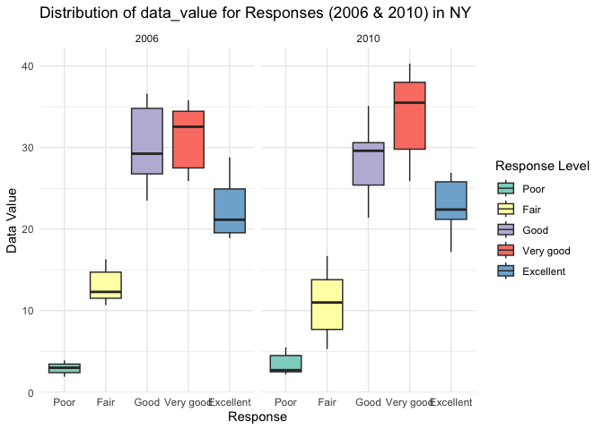
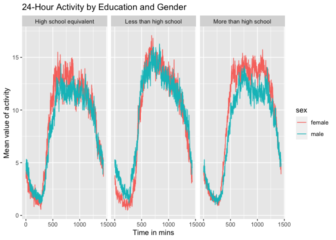

p8105_hw3_fz2377
================
Tara Zhan
2023-10-09

### Problem 1

``` r
total_aisles <- length(unique(instacart$aisle))
popular_aisles <- instacart |>
  group_by(aisle) |>
  summarise(item_count = n()) |>
  arrange(-item_count)
```

There are total of 134 aisles in this dataset, and “fresh vegetables”
aisle is the most items ordered from.

``` r
filtered_aisles <- instacart |>
  group_by(aisle) |>
  summarise(item_count = n()) |>
  filter(item_count > 10000) |>
  arrange(item_count)
ggplot(data = filtered_aisles, aes(x = aisle, y = item_count)) +
  geom_col() +
  theme(axis.text.x = element_text(angle = 45, hjust = 1)) +
  labs(title = "Items Ordered from Each Aisle",
       x = "Aisle",
       y = "Number of Items Ordered")
```

<!-- -->
This plot displays the number of items ordered in each aisle that with
more than 10000 items ordered, among all, fresh fruits and fresh
vegetables have the most orders.

``` r
selected_aisles <- instacart |>
  filter(aisle==c("baking ingredients", "dog food care", "packaged vegetables fruits")) |>
  group_by(aisle, product_name) |>
  summarise(order_count = n(), .groups = "drop") |>
  arrange(aisle, -order_count) |>
  slice_head(n = 3)
selected_aisles |> gt() |>
  tab_header(title = "Top 3 Items in Selected Aisles") |>
  cols_label(
    aisle = "Aisle",
    product_name = "Product Name",
    order_count = "Order Count"
  )
```

<div id="ujcovyiwby" style="padding-left:0px;padding-right:0px;padding-top:10px;padding-bottom:10px;overflow-x:auto;overflow-y:auto;width:auto;height:auto;">
<style>#ujcovyiwby table {
  font-family: system-ui, 'Segoe UI', Roboto, Helvetica, Arial, sans-serif, 'Apple Color Emoji', 'Segoe UI Emoji', 'Segoe UI Symbol', 'Noto Color Emoji';
  -webkit-font-smoothing: antialiased;
  -moz-osx-font-smoothing: grayscale;
}

#ujcovyiwby thead, #ujcovyiwby tbody, #ujcovyiwby tfoot, #ujcovyiwby tr, #ujcovyiwby td, #ujcovyiwby th {
  border-style: none;
}

#ujcovyiwby p {
  margin: 0;
  padding: 0;
}

#ujcovyiwby .gt_table {
  display: table;
  border-collapse: collapse;
  line-height: normal;
  margin-left: auto;
  margin-right: auto;
  color: #333333;
  font-size: 16px;
  font-weight: normal;
  font-style: normal;
  background-color: #FFFFFF;
  width: auto;
  border-top-style: solid;
  border-top-width: 2px;
  border-top-color: #A8A8A8;
  border-right-style: none;
  border-right-width: 2px;
  border-right-color: #D3D3D3;
  border-bottom-style: solid;
  border-bottom-width: 2px;
  border-bottom-color: #A8A8A8;
  border-left-style: none;
  border-left-width: 2px;
  border-left-color: #D3D3D3;
}

#ujcovyiwby .gt_caption {
  padding-top: 4px;
  padding-bottom: 4px;
}

#ujcovyiwby .gt_title {
  color: #333333;
  font-size: 125%;
  font-weight: initial;
  padding-top: 4px;
  padding-bottom: 4px;
  padding-left: 5px;
  padding-right: 5px;
  border-bottom-color: #FFFFFF;
  border-bottom-width: 0;
}

#ujcovyiwby .gt_subtitle {
  color: #333333;
  font-size: 85%;
  font-weight: initial;
  padding-top: 3px;
  padding-bottom: 5px;
  padding-left: 5px;
  padding-right: 5px;
  border-top-color: #FFFFFF;
  border-top-width: 0;
}

#ujcovyiwby .gt_heading {
  background-color: #FFFFFF;
  text-align: center;
  border-bottom-color: #FFFFFF;
  border-left-style: none;
  border-left-width: 1px;
  border-left-color: #D3D3D3;
  border-right-style: none;
  border-right-width: 1px;
  border-right-color: #D3D3D3;
}

#ujcovyiwby .gt_bottom_border {
  border-bottom-style: solid;
  border-bottom-width: 2px;
  border-bottom-color: #D3D3D3;
}

#ujcovyiwby .gt_col_headings {
  border-top-style: solid;
  border-top-width: 2px;
  border-top-color: #D3D3D3;
  border-bottom-style: solid;
  border-bottom-width: 2px;
  border-bottom-color: #D3D3D3;
  border-left-style: none;
  border-left-width: 1px;
  border-left-color: #D3D3D3;
  border-right-style: none;
  border-right-width: 1px;
  border-right-color: #D3D3D3;
}

#ujcovyiwby .gt_col_heading {
  color: #333333;
  background-color: #FFFFFF;
  font-size: 100%;
  font-weight: normal;
  text-transform: inherit;
  border-left-style: none;
  border-left-width: 1px;
  border-left-color: #D3D3D3;
  border-right-style: none;
  border-right-width: 1px;
  border-right-color: #D3D3D3;
  vertical-align: bottom;
  padding-top: 5px;
  padding-bottom: 6px;
  padding-left: 5px;
  padding-right: 5px;
  overflow-x: hidden;
}

#ujcovyiwby .gt_column_spanner_outer {
  color: #333333;
  background-color: #FFFFFF;
  font-size: 100%;
  font-weight: normal;
  text-transform: inherit;
  padding-top: 0;
  padding-bottom: 0;
  padding-left: 4px;
  padding-right: 4px;
}

#ujcovyiwby .gt_column_spanner_outer:first-child {
  padding-left: 0;
}

#ujcovyiwby .gt_column_spanner_outer:last-child {
  padding-right: 0;
}

#ujcovyiwby .gt_column_spanner {
  border-bottom-style: solid;
  border-bottom-width: 2px;
  border-bottom-color: #D3D3D3;
  vertical-align: bottom;
  padding-top: 5px;
  padding-bottom: 5px;
  overflow-x: hidden;
  display: inline-block;
  width: 100%;
}

#ujcovyiwby .gt_spanner_row {
  border-bottom-style: hidden;
}

#ujcovyiwby .gt_group_heading {
  padding-top: 8px;
  padding-bottom: 8px;
  padding-left: 5px;
  padding-right: 5px;
  color: #333333;
  background-color: #FFFFFF;
  font-size: 100%;
  font-weight: initial;
  text-transform: inherit;
  border-top-style: solid;
  border-top-width: 2px;
  border-top-color: #D3D3D3;
  border-bottom-style: solid;
  border-bottom-width: 2px;
  border-bottom-color: #D3D3D3;
  border-left-style: none;
  border-left-width: 1px;
  border-left-color: #D3D3D3;
  border-right-style: none;
  border-right-width: 1px;
  border-right-color: #D3D3D3;
  vertical-align: middle;
  text-align: left;
}

#ujcovyiwby .gt_empty_group_heading {
  padding: 0.5px;
  color: #333333;
  background-color: #FFFFFF;
  font-size: 100%;
  font-weight: initial;
  border-top-style: solid;
  border-top-width: 2px;
  border-top-color: #D3D3D3;
  border-bottom-style: solid;
  border-bottom-width: 2px;
  border-bottom-color: #D3D3D3;
  vertical-align: middle;
}

#ujcovyiwby .gt_from_md > :first-child {
  margin-top: 0;
}

#ujcovyiwby .gt_from_md > :last-child {
  margin-bottom: 0;
}

#ujcovyiwby .gt_row {
  padding-top: 8px;
  padding-bottom: 8px;
  padding-left: 5px;
  padding-right: 5px;
  margin: 10px;
  border-top-style: solid;
  border-top-width: 1px;
  border-top-color: #D3D3D3;
  border-left-style: none;
  border-left-width: 1px;
  border-left-color: #D3D3D3;
  border-right-style: none;
  border-right-width: 1px;
  border-right-color: #D3D3D3;
  vertical-align: middle;
  overflow-x: hidden;
}

#ujcovyiwby .gt_stub {
  color: #333333;
  background-color: #FFFFFF;
  font-size: 100%;
  font-weight: initial;
  text-transform: inherit;
  border-right-style: solid;
  border-right-width: 2px;
  border-right-color: #D3D3D3;
  padding-left: 5px;
  padding-right: 5px;
}

#ujcovyiwby .gt_stub_row_group {
  color: #333333;
  background-color: #FFFFFF;
  font-size: 100%;
  font-weight: initial;
  text-transform: inherit;
  border-right-style: solid;
  border-right-width: 2px;
  border-right-color: #D3D3D3;
  padding-left: 5px;
  padding-right: 5px;
  vertical-align: top;
}

#ujcovyiwby .gt_row_group_first td {
  border-top-width: 2px;
}

#ujcovyiwby .gt_row_group_first th {
  border-top-width: 2px;
}

#ujcovyiwby .gt_summary_row {
  color: #333333;
  background-color: #FFFFFF;
  text-transform: inherit;
  padding-top: 8px;
  padding-bottom: 8px;
  padding-left: 5px;
  padding-right: 5px;
}

#ujcovyiwby .gt_first_summary_row {
  border-top-style: solid;
  border-top-color: #D3D3D3;
}

#ujcovyiwby .gt_first_summary_row.thick {
  border-top-width: 2px;
}

#ujcovyiwby .gt_last_summary_row {
  padding-top: 8px;
  padding-bottom: 8px;
  padding-left: 5px;
  padding-right: 5px;
  border-bottom-style: solid;
  border-bottom-width: 2px;
  border-bottom-color: #D3D3D3;
}

#ujcovyiwby .gt_grand_summary_row {
  color: #333333;
  background-color: #FFFFFF;
  text-transform: inherit;
  padding-top: 8px;
  padding-bottom: 8px;
  padding-left: 5px;
  padding-right: 5px;
}

#ujcovyiwby .gt_first_grand_summary_row {
  padding-top: 8px;
  padding-bottom: 8px;
  padding-left: 5px;
  padding-right: 5px;
  border-top-style: double;
  border-top-width: 6px;
  border-top-color: #D3D3D3;
}

#ujcovyiwby .gt_last_grand_summary_row_top {
  padding-top: 8px;
  padding-bottom: 8px;
  padding-left: 5px;
  padding-right: 5px;
  border-bottom-style: double;
  border-bottom-width: 6px;
  border-bottom-color: #D3D3D3;
}

#ujcovyiwby .gt_striped {
  background-color: rgba(128, 128, 128, 0.05);
}

#ujcovyiwby .gt_table_body {
  border-top-style: solid;
  border-top-width: 2px;
  border-top-color: #D3D3D3;
  border-bottom-style: solid;
  border-bottom-width: 2px;
  border-bottom-color: #D3D3D3;
}

#ujcovyiwby .gt_footnotes {
  color: #333333;
  background-color: #FFFFFF;
  border-bottom-style: none;
  border-bottom-width: 2px;
  border-bottom-color: #D3D3D3;
  border-left-style: none;
  border-left-width: 2px;
  border-left-color: #D3D3D3;
  border-right-style: none;
  border-right-width: 2px;
  border-right-color: #D3D3D3;
}

#ujcovyiwby .gt_footnote {
  margin: 0px;
  font-size: 90%;
  padding-top: 4px;
  padding-bottom: 4px;
  padding-left: 5px;
  padding-right: 5px;
}

#ujcovyiwby .gt_sourcenotes {
  color: #333333;
  background-color: #FFFFFF;
  border-bottom-style: none;
  border-bottom-width: 2px;
  border-bottom-color: #D3D3D3;
  border-left-style: none;
  border-left-width: 2px;
  border-left-color: #D3D3D3;
  border-right-style: none;
  border-right-width: 2px;
  border-right-color: #D3D3D3;
}

#ujcovyiwby .gt_sourcenote {
  font-size: 90%;
  padding-top: 4px;
  padding-bottom: 4px;
  padding-left: 5px;
  padding-right: 5px;
}

#ujcovyiwby .gt_left {
  text-align: left;
}

#ujcovyiwby .gt_center {
  text-align: center;
}

#ujcovyiwby .gt_right {
  text-align: right;
  font-variant-numeric: tabular-nums;
}

#ujcovyiwby .gt_font_normal {
  font-weight: normal;
}

#ujcovyiwby .gt_font_bold {
  font-weight: bold;
}

#ujcovyiwby .gt_font_italic {
  font-style: italic;
}

#ujcovyiwby .gt_super {
  font-size: 65%;
}

#ujcovyiwby .gt_footnote_marks {
  font-size: 75%;
  vertical-align: 0.4em;
  position: initial;
}

#ujcovyiwby .gt_asterisk {
  font-size: 100%;
  vertical-align: 0;
}

#ujcovyiwby .gt_indent_1 {
  text-indent: 5px;
}

#ujcovyiwby .gt_indent_2 {
  text-indent: 10px;
}

#ujcovyiwby .gt_indent_3 {
  text-indent: 15px;
}

#ujcovyiwby .gt_indent_4 {
  text-indent: 20px;
}

#ujcovyiwby .gt_indent_5 {
  text-indent: 25px;
}
</style>
<table class="gt_table" data-quarto-disable-processing="false" data-quarto-bootstrap="false">
  <thead>
    <tr class="gt_heading">
      <td colspan="3" class="gt_heading gt_title gt_font_normal gt_bottom_border" style>Top 3 Items in Selected Aisles</td>
    </tr>
    
    <tr class="gt_col_headings">
      <th class="gt_col_heading gt_columns_bottom_border gt_left" rowspan="1" colspan="1" scope="col" id="Aisle">Aisle</th>
      <th class="gt_col_heading gt_columns_bottom_border gt_left" rowspan="1" colspan="1" scope="col" id="Product Name">Product Name</th>
      <th class="gt_col_heading gt_columns_bottom_border gt_right" rowspan="1" colspan="1" scope="col" id="Order Count">Order Count</th>
    </tr>
  </thead>
  <tbody class="gt_table_body">
    <tr><td headers="aisle" class="gt_row gt_left">baking ingredients</td>
<td headers="product_name" class="gt_row gt_left">Light Brown Sugar</td>
<td headers="order_count" class="gt_row gt_right">157</td></tr>
    <tr><td headers="aisle" class="gt_row gt_left">baking ingredients</td>
<td headers="product_name" class="gt_row gt_left">Pure Baking Soda</td>
<td headers="order_count" class="gt_row gt_right">140</td></tr>
    <tr><td headers="aisle" class="gt_row gt_left">baking ingredients</td>
<td headers="product_name" class="gt_row gt_left">Organic Vanilla Extract</td>
<td headers="order_count" class="gt_row gt_right">122</td></tr>
  </tbody>
  
  
</table>
</div>

This table shows the the number of times each item is ordered in three
most popular items from three aisles (“baking ingredients”, “dog food
care”, and “packaged vegetables fruits”).

``` r
selected_items <- instacart |>
  filter(product_name %in% c("Pink Lady Apples", "Coffee Ice Cream")) |>
  group_by(product_name, order_dow) |>
  summarise(mean_hour = mean(order_hour_of_day), .groups = "drop") |>
  pivot_wider(names_from = product_name, values_from = mean_hour) |>
  mutate(order_dow = factor(order_dow,
                            labels = c("Sunday", "Monday", "Tuesday", "Wednesday", "Thursday", "Friday", "Saturday")))
selected_items |> gt() |>
  tab_header(title = "Mean Order Hour for Selected Items") |>
  cols_label(
    order_dow = "Day of Week",
    `Pink Lady Apples` = "Pink Lady Apples (Mean Hour)",
    `Coffee Ice Cream` = "Coffee Ice Cream (Mean Hour)"
  ) |>
  fmt_number(
    columns = vars(`Pink Lady Apples`, `Coffee Ice Cream`),
    decimals = 2
  )
```

<div id="uytxmqliyp" style="padding-left:0px;padding-right:0px;padding-top:10px;padding-bottom:10px;overflow-x:auto;overflow-y:auto;width:auto;height:auto;">
<style>#uytxmqliyp table {
  font-family: system-ui, 'Segoe UI', Roboto, Helvetica, Arial, sans-serif, 'Apple Color Emoji', 'Segoe UI Emoji', 'Segoe UI Symbol', 'Noto Color Emoji';
  -webkit-font-smoothing: antialiased;
  -moz-osx-font-smoothing: grayscale;
}

#uytxmqliyp thead, #uytxmqliyp tbody, #uytxmqliyp tfoot, #uytxmqliyp tr, #uytxmqliyp td, #uytxmqliyp th {
  border-style: none;
}

#uytxmqliyp p {
  margin: 0;
  padding: 0;
}

#uytxmqliyp .gt_table {
  display: table;
  border-collapse: collapse;
  line-height: normal;
  margin-left: auto;
  margin-right: auto;
  color: #333333;
  font-size: 16px;
  font-weight: normal;
  font-style: normal;
  background-color: #FFFFFF;
  width: auto;
  border-top-style: solid;
  border-top-width: 2px;
  border-top-color: #A8A8A8;
  border-right-style: none;
  border-right-width: 2px;
  border-right-color: #D3D3D3;
  border-bottom-style: solid;
  border-bottom-width: 2px;
  border-bottom-color: #A8A8A8;
  border-left-style: none;
  border-left-width: 2px;
  border-left-color: #D3D3D3;
}

#uytxmqliyp .gt_caption {
  padding-top: 4px;
  padding-bottom: 4px;
}

#uytxmqliyp .gt_title {
  color: #333333;
  font-size: 125%;
  font-weight: initial;
  padding-top: 4px;
  padding-bottom: 4px;
  padding-left: 5px;
  padding-right: 5px;
  border-bottom-color: #FFFFFF;
  border-bottom-width: 0;
}

#uytxmqliyp .gt_subtitle {
  color: #333333;
  font-size: 85%;
  font-weight: initial;
  padding-top: 3px;
  padding-bottom: 5px;
  padding-left: 5px;
  padding-right: 5px;
  border-top-color: #FFFFFF;
  border-top-width: 0;
}

#uytxmqliyp .gt_heading {
  background-color: #FFFFFF;
  text-align: center;
  border-bottom-color: #FFFFFF;
  border-left-style: none;
  border-left-width: 1px;
  border-left-color: #D3D3D3;
  border-right-style: none;
  border-right-width: 1px;
  border-right-color: #D3D3D3;
}

#uytxmqliyp .gt_bottom_border {
  border-bottom-style: solid;
  border-bottom-width: 2px;
  border-bottom-color: #D3D3D3;
}

#uytxmqliyp .gt_col_headings {
  border-top-style: solid;
  border-top-width: 2px;
  border-top-color: #D3D3D3;
  border-bottom-style: solid;
  border-bottom-width: 2px;
  border-bottom-color: #D3D3D3;
  border-left-style: none;
  border-left-width: 1px;
  border-left-color: #D3D3D3;
  border-right-style: none;
  border-right-width: 1px;
  border-right-color: #D3D3D3;
}

#uytxmqliyp .gt_col_heading {
  color: #333333;
  background-color: #FFFFFF;
  font-size: 100%;
  font-weight: normal;
  text-transform: inherit;
  border-left-style: none;
  border-left-width: 1px;
  border-left-color: #D3D3D3;
  border-right-style: none;
  border-right-width: 1px;
  border-right-color: #D3D3D3;
  vertical-align: bottom;
  padding-top: 5px;
  padding-bottom: 6px;
  padding-left: 5px;
  padding-right: 5px;
  overflow-x: hidden;
}

#uytxmqliyp .gt_column_spanner_outer {
  color: #333333;
  background-color: #FFFFFF;
  font-size: 100%;
  font-weight: normal;
  text-transform: inherit;
  padding-top: 0;
  padding-bottom: 0;
  padding-left: 4px;
  padding-right: 4px;
}

#uytxmqliyp .gt_column_spanner_outer:first-child {
  padding-left: 0;
}

#uytxmqliyp .gt_column_spanner_outer:last-child {
  padding-right: 0;
}

#uytxmqliyp .gt_column_spanner {
  border-bottom-style: solid;
  border-bottom-width: 2px;
  border-bottom-color: #D3D3D3;
  vertical-align: bottom;
  padding-top: 5px;
  padding-bottom: 5px;
  overflow-x: hidden;
  display: inline-block;
  width: 100%;
}

#uytxmqliyp .gt_spanner_row {
  border-bottom-style: hidden;
}

#uytxmqliyp .gt_group_heading {
  padding-top: 8px;
  padding-bottom: 8px;
  padding-left: 5px;
  padding-right: 5px;
  color: #333333;
  background-color: #FFFFFF;
  font-size: 100%;
  font-weight: initial;
  text-transform: inherit;
  border-top-style: solid;
  border-top-width: 2px;
  border-top-color: #D3D3D3;
  border-bottom-style: solid;
  border-bottom-width: 2px;
  border-bottom-color: #D3D3D3;
  border-left-style: none;
  border-left-width: 1px;
  border-left-color: #D3D3D3;
  border-right-style: none;
  border-right-width: 1px;
  border-right-color: #D3D3D3;
  vertical-align: middle;
  text-align: left;
}

#uytxmqliyp .gt_empty_group_heading {
  padding: 0.5px;
  color: #333333;
  background-color: #FFFFFF;
  font-size: 100%;
  font-weight: initial;
  border-top-style: solid;
  border-top-width: 2px;
  border-top-color: #D3D3D3;
  border-bottom-style: solid;
  border-bottom-width: 2px;
  border-bottom-color: #D3D3D3;
  vertical-align: middle;
}

#uytxmqliyp .gt_from_md > :first-child {
  margin-top: 0;
}

#uytxmqliyp .gt_from_md > :last-child {
  margin-bottom: 0;
}

#uytxmqliyp .gt_row {
  padding-top: 8px;
  padding-bottom: 8px;
  padding-left: 5px;
  padding-right: 5px;
  margin: 10px;
  border-top-style: solid;
  border-top-width: 1px;
  border-top-color: #D3D3D3;
  border-left-style: none;
  border-left-width: 1px;
  border-left-color: #D3D3D3;
  border-right-style: none;
  border-right-width: 1px;
  border-right-color: #D3D3D3;
  vertical-align: middle;
  overflow-x: hidden;
}

#uytxmqliyp .gt_stub {
  color: #333333;
  background-color: #FFFFFF;
  font-size: 100%;
  font-weight: initial;
  text-transform: inherit;
  border-right-style: solid;
  border-right-width: 2px;
  border-right-color: #D3D3D3;
  padding-left: 5px;
  padding-right: 5px;
}

#uytxmqliyp .gt_stub_row_group {
  color: #333333;
  background-color: #FFFFFF;
  font-size: 100%;
  font-weight: initial;
  text-transform: inherit;
  border-right-style: solid;
  border-right-width: 2px;
  border-right-color: #D3D3D3;
  padding-left: 5px;
  padding-right: 5px;
  vertical-align: top;
}

#uytxmqliyp .gt_row_group_first td {
  border-top-width: 2px;
}

#uytxmqliyp .gt_row_group_first th {
  border-top-width: 2px;
}

#uytxmqliyp .gt_summary_row {
  color: #333333;
  background-color: #FFFFFF;
  text-transform: inherit;
  padding-top: 8px;
  padding-bottom: 8px;
  padding-left: 5px;
  padding-right: 5px;
}

#uytxmqliyp .gt_first_summary_row {
  border-top-style: solid;
  border-top-color: #D3D3D3;
}

#uytxmqliyp .gt_first_summary_row.thick {
  border-top-width: 2px;
}

#uytxmqliyp .gt_last_summary_row {
  padding-top: 8px;
  padding-bottom: 8px;
  padding-left: 5px;
  padding-right: 5px;
  border-bottom-style: solid;
  border-bottom-width: 2px;
  border-bottom-color: #D3D3D3;
}

#uytxmqliyp .gt_grand_summary_row {
  color: #333333;
  background-color: #FFFFFF;
  text-transform: inherit;
  padding-top: 8px;
  padding-bottom: 8px;
  padding-left: 5px;
  padding-right: 5px;
}

#uytxmqliyp .gt_first_grand_summary_row {
  padding-top: 8px;
  padding-bottom: 8px;
  padding-left: 5px;
  padding-right: 5px;
  border-top-style: double;
  border-top-width: 6px;
  border-top-color: #D3D3D3;
}

#uytxmqliyp .gt_last_grand_summary_row_top {
  padding-top: 8px;
  padding-bottom: 8px;
  padding-left: 5px;
  padding-right: 5px;
  border-bottom-style: double;
  border-bottom-width: 6px;
  border-bottom-color: #D3D3D3;
}

#uytxmqliyp .gt_striped {
  background-color: rgba(128, 128, 128, 0.05);
}

#uytxmqliyp .gt_table_body {
  border-top-style: solid;
  border-top-width: 2px;
  border-top-color: #D3D3D3;
  border-bottom-style: solid;
  border-bottom-width: 2px;
  border-bottom-color: #D3D3D3;
}

#uytxmqliyp .gt_footnotes {
  color: #333333;
  background-color: #FFFFFF;
  border-bottom-style: none;
  border-bottom-width: 2px;
  border-bottom-color: #D3D3D3;
  border-left-style: none;
  border-left-width: 2px;
  border-left-color: #D3D3D3;
  border-right-style: none;
  border-right-width: 2px;
  border-right-color: #D3D3D3;
}

#uytxmqliyp .gt_footnote {
  margin: 0px;
  font-size: 90%;
  padding-top: 4px;
  padding-bottom: 4px;
  padding-left: 5px;
  padding-right: 5px;
}

#uytxmqliyp .gt_sourcenotes {
  color: #333333;
  background-color: #FFFFFF;
  border-bottom-style: none;
  border-bottom-width: 2px;
  border-bottom-color: #D3D3D3;
  border-left-style: none;
  border-left-width: 2px;
  border-left-color: #D3D3D3;
  border-right-style: none;
  border-right-width: 2px;
  border-right-color: #D3D3D3;
}

#uytxmqliyp .gt_sourcenote {
  font-size: 90%;
  padding-top: 4px;
  padding-bottom: 4px;
  padding-left: 5px;
  padding-right: 5px;
}

#uytxmqliyp .gt_left {
  text-align: left;
}

#uytxmqliyp .gt_center {
  text-align: center;
}

#uytxmqliyp .gt_right {
  text-align: right;
  font-variant-numeric: tabular-nums;
}

#uytxmqliyp .gt_font_normal {
  font-weight: normal;
}

#uytxmqliyp .gt_font_bold {
  font-weight: bold;
}

#uytxmqliyp .gt_font_italic {
  font-style: italic;
}

#uytxmqliyp .gt_super {
  font-size: 65%;
}

#uytxmqliyp .gt_footnote_marks {
  font-size: 75%;
  vertical-align: 0.4em;
  position: initial;
}

#uytxmqliyp .gt_asterisk {
  font-size: 100%;
  vertical-align: 0;
}

#uytxmqliyp .gt_indent_1 {
  text-indent: 5px;
}

#uytxmqliyp .gt_indent_2 {
  text-indent: 10px;
}

#uytxmqliyp .gt_indent_3 {
  text-indent: 15px;
}

#uytxmqliyp .gt_indent_4 {
  text-indent: 20px;
}

#uytxmqliyp .gt_indent_5 {
  text-indent: 25px;
}
</style>
<table class="gt_table" data-quarto-disable-processing="false" data-quarto-bootstrap="false">
  <thead>
    <tr class="gt_heading">
      <td colspan="3" class="gt_heading gt_title gt_font_normal gt_bottom_border" style>Mean Order Hour for Selected Items</td>
    </tr>
    
    <tr class="gt_col_headings">
      <th class="gt_col_heading gt_columns_bottom_border gt_center" rowspan="1" colspan="1" scope="col" id="Day of Week">Day of Week</th>
      <th class="gt_col_heading gt_columns_bottom_border gt_right" rowspan="1" colspan="1" scope="col" id="Coffee Ice Cream (Mean Hour)">Coffee Ice Cream (Mean Hour)</th>
      <th class="gt_col_heading gt_columns_bottom_border gt_right" rowspan="1" colspan="1" scope="col" id="Pink Lady Apples (Mean Hour)">Pink Lady Apples (Mean Hour)</th>
    </tr>
  </thead>
  <tbody class="gt_table_body">
    <tr><td headers="order_dow" class="gt_row gt_center">Sunday</td>
<td headers="Coffee Ice Cream" class="gt_row gt_right">13.77</td>
<td headers="Pink Lady Apples" class="gt_row gt_right">13.44</td></tr>
    <tr><td headers="order_dow" class="gt_row gt_center">Monday</td>
<td headers="Coffee Ice Cream" class="gt_row gt_right">14.32</td>
<td headers="Pink Lady Apples" class="gt_row gt_right">11.36</td></tr>
    <tr><td headers="order_dow" class="gt_row gt_center">Tuesday</td>
<td headers="Coffee Ice Cream" class="gt_row gt_right">15.38</td>
<td headers="Pink Lady Apples" class="gt_row gt_right">11.70</td></tr>
    <tr><td headers="order_dow" class="gt_row gt_center">Wednesday</td>
<td headers="Coffee Ice Cream" class="gt_row gt_right">15.32</td>
<td headers="Pink Lady Apples" class="gt_row gt_right">14.25</td></tr>
    <tr><td headers="order_dow" class="gt_row gt_center">Thursday</td>
<td headers="Coffee Ice Cream" class="gt_row gt_right">15.22</td>
<td headers="Pink Lady Apples" class="gt_row gt_right">11.55</td></tr>
    <tr><td headers="order_dow" class="gt_row gt_center">Friday</td>
<td headers="Coffee Ice Cream" class="gt_row gt_right">12.26</td>
<td headers="Pink Lady Apples" class="gt_row gt_right">12.78</td></tr>
    <tr><td headers="order_dow" class="gt_row gt_center">Saturday</td>
<td headers="Coffee Ice Cream" class="gt_row gt_right">13.83</td>
<td headers="Pink Lady Apples" class="gt_row gt_right">11.94</td></tr>
  </tbody>
  
  
</table>
</div>

This table shows the mean hour of the day at which Pink Lady Apples and
Coffee Ice Cream are ordered throughout a week.

### Problem 2

``` r
library(p8105.datasets)
data("brfss_smart2010")
cleaned_brfss <- brfss_smart2010 |>
  janitor::clean_names() |>
  filter(
    topic == "Overall Health", 
    response %in% c("Excellent", "Very good", "Good", "Fair", "Poor")
    ) |>
  mutate(
    response = factor(response, levels = c("Poor", "Fair", "Good", "Very good", "Excellent"))
  )
```

``` r
states_observed <- cleaned_brfss |>
  group_by(year, locationabbr) |>
  summarise(locations_count = n_distinct(locationdesc), .groups = "drop") |>
  filter(locations_count >= 7)|>
  arrange(desc(locations_count))
#in 2002
states_2002 <- filter(states_observed, year == 2002) 
states_2002 |> gt() |>
  tab_header(title = "States that observed at 7 or more locations in 2002") |>
  cols_label(
    locationabbr = "States",
    locations_count = "Locations Count"
  )
```

<div id="rivfgfedod" style="padding-left:0px;padding-right:0px;padding-top:10px;padding-bottom:10px;overflow-x:auto;overflow-y:auto;width:auto;height:auto;">
<style>#rivfgfedod table {
  font-family: system-ui, 'Segoe UI', Roboto, Helvetica, Arial, sans-serif, 'Apple Color Emoji', 'Segoe UI Emoji', 'Segoe UI Symbol', 'Noto Color Emoji';
  -webkit-font-smoothing: antialiased;
  -moz-osx-font-smoothing: grayscale;
}

#rivfgfedod thead, #rivfgfedod tbody, #rivfgfedod tfoot, #rivfgfedod tr, #rivfgfedod td, #rivfgfedod th {
  border-style: none;
}

#rivfgfedod p {
  margin: 0;
  padding: 0;
}

#rivfgfedod .gt_table {
  display: table;
  border-collapse: collapse;
  line-height: normal;
  margin-left: auto;
  margin-right: auto;
  color: #333333;
  font-size: 16px;
  font-weight: normal;
  font-style: normal;
  background-color: #FFFFFF;
  width: auto;
  border-top-style: solid;
  border-top-width: 2px;
  border-top-color: #A8A8A8;
  border-right-style: none;
  border-right-width: 2px;
  border-right-color: #D3D3D3;
  border-bottom-style: solid;
  border-bottom-width: 2px;
  border-bottom-color: #A8A8A8;
  border-left-style: none;
  border-left-width: 2px;
  border-left-color: #D3D3D3;
}

#rivfgfedod .gt_caption {
  padding-top: 4px;
  padding-bottom: 4px;
}

#rivfgfedod .gt_title {
  color: #333333;
  font-size: 125%;
  font-weight: initial;
  padding-top: 4px;
  padding-bottom: 4px;
  padding-left: 5px;
  padding-right: 5px;
  border-bottom-color: #FFFFFF;
  border-bottom-width: 0;
}

#rivfgfedod .gt_subtitle {
  color: #333333;
  font-size: 85%;
  font-weight: initial;
  padding-top: 3px;
  padding-bottom: 5px;
  padding-left: 5px;
  padding-right: 5px;
  border-top-color: #FFFFFF;
  border-top-width: 0;
}

#rivfgfedod .gt_heading {
  background-color: #FFFFFF;
  text-align: center;
  border-bottom-color: #FFFFFF;
  border-left-style: none;
  border-left-width: 1px;
  border-left-color: #D3D3D3;
  border-right-style: none;
  border-right-width: 1px;
  border-right-color: #D3D3D3;
}

#rivfgfedod .gt_bottom_border {
  border-bottom-style: solid;
  border-bottom-width: 2px;
  border-bottom-color: #D3D3D3;
}

#rivfgfedod .gt_col_headings {
  border-top-style: solid;
  border-top-width: 2px;
  border-top-color: #D3D3D3;
  border-bottom-style: solid;
  border-bottom-width: 2px;
  border-bottom-color: #D3D3D3;
  border-left-style: none;
  border-left-width: 1px;
  border-left-color: #D3D3D3;
  border-right-style: none;
  border-right-width: 1px;
  border-right-color: #D3D3D3;
}

#rivfgfedod .gt_col_heading {
  color: #333333;
  background-color: #FFFFFF;
  font-size: 100%;
  font-weight: normal;
  text-transform: inherit;
  border-left-style: none;
  border-left-width: 1px;
  border-left-color: #D3D3D3;
  border-right-style: none;
  border-right-width: 1px;
  border-right-color: #D3D3D3;
  vertical-align: bottom;
  padding-top: 5px;
  padding-bottom: 6px;
  padding-left: 5px;
  padding-right: 5px;
  overflow-x: hidden;
}

#rivfgfedod .gt_column_spanner_outer {
  color: #333333;
  background-color: #FFFFFF;
  font-size: 100%;
  font-weight: normal;
  text-transform: inherit;
  padding-top: 0;
  padding-bottom: 0;
  padding-left: 4px;
  padding-right: 4px;
}

#rivfgfedod .gt_column_spanner_outer:first-child {
  padding-left: 0;
}

#rivfgfedod .gt_column_spanner_outer:last-child {
  padding-right: 0;
}

#rivfgfedod .gt_column_spanner {
  border-bottom-style: solid;
  border-bottom-width: 2px;
  border-bottom-color: #D3D3D3;
  vertical-align: bottom;
  padding-top: 5px;
  padding-bottom: 5px;
  overflow-x: hidden;
  display: inline-block;
  width: 100%;
}

#rivfgfedod .gt_spanner_row {
  border-bottom-style: hidden;
}

#rivfgfedod .gt_group_heading {
  padding-top: 8px;
  padding-bottom: 8px;
  padding-left: 5px;
  padding-right: 5px;
  color: #333333;
  background-color: #FFFFFF;
  font-size: 100%;
  font-weight: initial;
  text-transform: inherit;
  border-top-style: solid;
  border-top-width: 2px;
  border-top-color: #D3D3D3;
  border-bottom-style: solid;
  border-bottom-width: 2px;
  border-bottom-color: #D3D3D3;
  border-left-style: none;
  border-left-width: 1px;
  border-left-color: #D3D3D3;
  border-right-style: none;
  border-right-width: 1px;
  border-right-color: #D3D3D3;
  vertical-align: middle;
  text-align: left;
}

#rivfgfedod .gt_empty_group_heading {
  padding: 0.5px;
  color: #333333;
  background-color: #FFFFFF;
  font-size: 100%;
  font-weight: initial;
  border-top-style: solid;
  border-top-width: 2px;
  border-top-color: #D3D3D3;
  border-bottom-style: solid;
  border-bottom-width: 2px;
  border-bottom-color: #D3D3D3;
  vertical-align: middle;
}

#rivfgfedod .gt_from_md > :first-child {
  margin-top: 0;
}

#rivfgfedod .gt_from_md > :last-child {
  margin-bottom: 0;
}

#rivfgfedod .gt_row {
  padding-top: 8px;
  padding-bottom: 8px;
  padding-left: 5px;
  padding-right: 5px;
  margin: 10px;
  border-top-style: solid;
  border-top-width: 1px;
  border-top-color: #D3D3D3;
  border-left-style: none;
  border-left-width: 1px;
  border-left-color: #D3D3D3;
  border-right-style: none;
  border-right-width: 1px;
  border-right-color: #D3D3D3;
  vertical-align: middle;
  overflow-x: hidden;
}

#rivfgfedod .gt_stub {
  color: #333333;
  background-color: #FFFFFF;
  font-size: 100%;
  font-weight: initial;
  text-transform: inherit;
  border-right-style: solid;
  border-right-width: 2px;
  border-right-color: #D3D3D3;
  padding-left: 5px;
  padding-right: 5px;
}

#rivfgfedod .gt_stub_row_group {
  color: #333333;
  background-color: #FFFFFF;
  font-size: 100%;
  font-weight: initial;
  text-transform: inherit;
  border-right-style: solid;
  border-right-width: 2px;
  border-right-color: #D3D3D3;
  padding-left: 5px;
  padding-right: 5px;
  vertical-align: top;
}

#rivfgfedod .gt_row_group_first td {
  border-top-width: 2px;
}

#rivfgfedod .gt_row_group_first th {
  border-top-width: 2px;
}

#rivfgfedod .gt_summary_row {
  color: #333333;
  background-color: #FFFFFF;
  text-transform: inherit;
  padding-top: 8px;
  padding-bottom: 8px;
  padding-left: 5px;
  padding-right: 5px;
}

#rivfgfedod .gt_first_summary_row {
  border-top-style: solid;
  border-top-color: #D3D3D3;
}

#rivfgfedod .gt_first_summary_row.thick {
  border-top-width: 2px;
}

#rivfgfedod .gt_last_summary_row {
  padding-top: 8px;
  padding-bottom: 8px;
  padding-left: 5px;
  padding-right: 5px;
  border-bottom-style: solid;
  border-bottom-width: 2px;
  border-bottom-color: #D3D3D3;
}

#rivfgfedod .gt_grand_summary_row {
  color: #333333;
  background-color: #FFFFFF;
  text-transform: inherit;
  padding-top: 8px;
  padding-bottom: 8px;
  padding-left: 5px;
  padding-right: 5px;
}

#rivfgfedod .gt_first_grand_summary_row {
  padding-top: 8px;
  padding-bottom: 8px;
  padding-left: 5px;
  padding-right: 5px;
  border-top-style: double;
  border-top-width: 6px;
  border-top-color: #D3D3D3;
}

#rivfgfedod .gt_last_grand_summary_row_top {
  padding-top: 8px;
  padding-bottom: 8px;
  padding-left: 5px;
  padding-right: 5px;
  border-bottom-style: double;
  border-bottom-width: 6px;
  border-bottom-color: #D3D3D3;
}

#rivfgfedod .gt_striped {
  background-color: rgba(128, 128, 128, 0.05);
}

#rivfgfedod .gt_table_body {
  border-top-style: solid;
  border-top-width: 2px;
  border-top-color: #D3D3D3;
  border-bottom-style: solid;
  border-bottom-width: 2px;
  border-bottom-color: #D3D3D3;
}

#rivfgfedod .gt_footnotes {
  color: #333333;
  background-color: #FFFFFF;
  border-bottom-style: none;
  border-bottom-width: 2px;
  border-bottom-color: #D3D3D3;
  border-left-style: none;
  border-left-width: 2px;
  border-left-color: #D3D3D3;
  border-right-style: none;
  border-right-width: 2px;
  border-right-color: #D3D3D3;
}

#rivfgfedod .gt_footnote {
  margin: 0px;
  font-size: 90%;
  padding-top: 4px;
  padding-bottom: 4px;
  padding-left: 5px;
  padding-right: 5px;
}

#rivfgfedod .gt_sourcenotes {
  color: #333333;
  background-color: #FFFFFF;
  border-bottom-style: none;
  border-bottom-width: 2px;
  border-bottom-color: #D3D3D3;
  border-left-style: none;
  border-left-width: 2px;
  border-left-color: #D3D3D3;
  border-right-style: none;
  border-right-width: 2px;
  border-right-color: #D3D3D3;
}

#rivfgfedod .gt_sourcenote {
  font-size: 90%;
  padding-top: 4px;
  padding-bottom: 4px;
  padding-left: 5px;
  padding-right: 5px;
}

#rivfgfedod .gt_left {
  text-align: left;
}

#rivfgfedod .gt_center {
  text-align: center;
}

#rivfgfedod .gt_right {
  text-align: right;
  font-variant-numeric: tabular-nums;
}

#rivfgfedod .gt_font_normal {
  font-weight: normal;
}

#rivfgfedod .gt_font_bold {
  font-weight: bold;
}

#rivfgfedod .gt_font_italic {
  font-style: italic;
}

#rivfgfedod .gt_super {
  font-size: 65%;
}

#rivfgfedod .gt_footnote_marks {
  font-size: 75%;
  vertical-align: 0.4em;
  position: initial;
}

#rivfgfedod .gt_asterisk {
  font-size: 100%;
  vertical-align: 0;
}

#rivfgfedod .gt_indent_1 {
  text-indent: 5px;
}

#rivfgfedod .gt_indent_2 {
  text-indent: 10px;
}

#rivfgfedod .gt_indent_3 {
  text-indent: 15px;
}

#rivfgfedod .gt_indent_4 {
  text-indent: 20px;
}

#rivfgfedod .gt_indent_5 {
  text-indent: 25px;
}
</style>
<table class="gt_table" data-quarto-disable-processing="false" data-quarto-bootstrap="false">
  <thead>
    <tr class="gt_heading">
      <td colspan="3" class="gt_heading gt_title gt_font_normal gt_bottom_border" style>States that observed at 7 or more locations in 2002</td>
    </tr>
    
    <tr class="gt_col_headings">
      <th class="gt_col_heading gt_columns_bottom_border gt_right" rowspan="1" colspan="1" scope="col" id="year">year</th>
      <th class="gt_col_heading gt_columns_bottom_border gt_left" rowspan="1" colspan="1" scope="col" id="States">States</th>
      <th class="gt_col_heading gt_columns_bottom_border gt_right" rowspan="1" colspan="1" scope="col" id="Locations Count">Locations Count</th>
    </tr>
  </thead>
  <tbody class="gt_table_body">
    <tr><td headers="year" class="gt_row gt_right">2002</td>
<td headers="locationabbr" class="gt_row gt_left">PA</td>
<td headers="locations_count" class="gt_row gt_right">10</td></tr>
    <tr><td headers="year" class="gt_row gt_right">2002</td>
<td headers="locationabbr" class="gt_row gt_left">MA</td>
<td headers="locations_count" class="gt_row gt_right">8</td></tr>
    <tr><td headers="year" class="gt_row gt_right">2002</td>
<td headers="locationabbr" class="gt_row gt_left">NJ</td>
<td headers="locations_count" class="gt_row gt_right">8</td></tr>
    <tr><td headers="year" class="gt_row gt_right">2002</td>
<td headers="locationabbr" class="gt_row gt_left">CT</td>
<td headers="locations_count" class="gt_row gt_right">7</td></tr>
    <tr><td headers="year" class="gt_row gt_right">2002</td>
<td headers="locationabbr" class="gt_row gt_left">FL</td>
<td headers="locations_count" class="gt_row gt_right">7</td></tr>
    <tr><td headers="year" class="gt_row gt_right">2002</td>
<td headers="locationabbr" class="gt_row gt_left">NC</td>
<td headers="locations_count" class="gt_row gt_right">7</td></tr>
  </tbody>
  
  
</table>
</div>

``` r
#in 2010
states_2010 <- filter(states_observed, year == 2010)
states_2010 |> gt() |>
  tab_header(title = "States that observed at 7 or more locations in 2010") |>
  cols_label(
    locationabbr = "States",
    locations_count = "Locations Count"
  )
```

<div id="xiwhvotchy" style="padding-left:0px;padding-right:0px;padding-top:10px;padding-bottom:10px;overflow-x:auto;overflow-y:auto;width:auto;height:auto;">
<style>#xiwhvotchy table {
  font-family: system-ui, 'Segoe UI', Roboto, Helvetica, Arial, sans-serif, 'Apple Color Emoji', 'Segoe UI Emoji', 'Segoe UI Symbol', 'Noto Color Emoji';
  -webkit-font-smoothing: antialiased;
  -moz-osx-font-smoothing: grayscale;
}

#xiwhvotchy thead, #xiwhvotchy tbody, #xiwhvotchy tfoot, #xiwhvotchy tr, #xiwhvotchy td, #xiwhvotchy th {
  border-style: none;
}

#xiwhvotchy p {
  margin: 0;
  padding: 0;
}

#xiwhvotchy .gt_table {
  display: table;
  border-collapse: collapse;
  line-height: normal;
  margin-left: auto;
  margin-right: auto;
  color: #333333;
  font-size: 16px;
  font-weight: normal;
  font-style: normal;
  background-color: #FFFFFF;
  width: auto;
  border-top-style: solid;
  border-top-width: 2px;
  border-top-color: #A8A8A8;
  border-right-style: none;
  border-right-width: 2px;
  border-right-color: #D3D3D3;
  border-bottom-style: solid;
  border-bottom-width: 2px;
  border-bottom-color: #A8A8A8;
  border-left-style: none;
  border-left-width: 2px;
  border-left-color: #D3D3D3;
}

#xiwhvotchy .gt_caption {
  padding-top: 4px;
  padding-bottom: 4px;
}

#xiwhvotchy .gt_title {
  color: #333333;
  font-size: 125%;
  font-weight: initial;
  padding-top: 4px;
  padding-bottom: 4px;
  padding-left: 5px;
  padding-right: 5px;
  border-bottom-color: #FFFFFF;
  border-bottom-width: 0;
}

#xiwhvotchy .gt_subtitle {
  color: #333333;
  font-size: 85%;
  font-weight: initial;
  padding-top: 3px;
  padding-bottom: 5px;
  padding-left: 5px;
  padding-right: 5px;
  border-top-color: #FFFFFF;
  border-top-width: 0;
}

#xiwhvotchy .gt_heading {
  background-color: #FFFFFF;
  text-align: center;
  border-bottom-color: #FFFFFF;
  border-left-style: none;
  border-left-width: 1px;
  border-left-color: #D3D3D3;
  border-right-style: none;
  border-right-width: 1px;
  border-right-color: #D3D3D3;
}

#xiwhvotchy .gt_bottom_border {
  border-bottom-style: solid;
  border-bottom-width: 2px;
  border-bottom-color: #D3D3D3;
}

#xiwhvotchy .gt_col_headings {
  border-top-style: solid;
  border-top-width: 2px;
  border-top-color: #D3D3D3;
  border-bottom-style: solid;
  border-bottom-width: 2px;
  border-bottom-color: #D3D3D3;
  border-left-style: none;
  border-left-width: 1px;
  border-left-color: #D3D3D3;
  border-right-style: none;
  border-right-width: 1px;
  border-right-color: #D3D3D3;
}

#xiwhvotchy .gt_col_heading {
  color: #333333;
  background-color: #FFFFFF;
  font-size: 100%;
  font-weight: normal;
  text-transform: inherit;
  border-left-style: none;
  border-left-width: 1px;
  border-left-color: #D3D3D3;
  border-right-style: none;
  border-right-width: 1px;
  border-right-color: #D3D3D3;
  vertical-align: bottom;
  padding-top: 5px;
  padding-bottom: 6px;
  padding-left: 5px;
  padding-right: 5px;
  overflow-x: hidden;
}

#xiwhvotchy .gt_column_spanner_outer {
  color: #333333;
  background-color: #FFFFFF;
  font-size: 100%;
  font-weight: normal;
  text-transform: inherit;
  padding-top: 0;
  padding-bottom: 0;
  padding-left: 4px;
  padding-right: 4px;
}

#xiwhvotchy .gt_column_spanner_outer:first-child {
  padding-left: 0;
}

#xiwhvotchy .gt_column_spanner_outer:last-child {
  padding-right: 0;
}

#xiwhvotchy .gt_column_spanner {
  border-bottom-style: solid;
  border-bottom-width: 2px;
  border-bottom-color: #D3D3D3;
  vertical-align: bottom;
  padding-top: 5px;
  padding-bottom: 5px;
  overflow-x: hidden;
  display: inline-block;
  width: 100%;
}

#xiwhvotchy .gt_spanner_row {
  border-bottom-style: hidden;
}

#xiwhvotchy .gt_group_heading {
  padding-top: 8px;
  padding-bottom: 8px;
  padding-left: 5px;
  padding-right: 5px;
  color: #333333;
  background-color: #FFFFFF;
  font-size: 100%;
  font-weight: initial;
  text-transform: inherit;
  border-top-style: solid;
  border-top-width: 2px;
  border-top-color: #D3D3D3;
  border-bottom-style: solid;
  border-bottom-width: 2px;
  border-bottom-color: #D3D3D3;
  border-left-style: none;
  border-left-width: 1px;
  border-left-color: #D3D3D3;
  border-right-style: none;
  border-right-width: 1px;
  border-right-color: #D3D3D3;
  vertical-align: middle;
  text-align: left;
}

#xiwhvotchy .gt_empty_group_heading {
  padding: 0.5px;
  color: #333333;
  background-color: #FFFFFF;
  font-size: 100%;
  font-weight: initial;
  border-top-style: solid;
  border-top-width: 2px;
  border-top-color: #D3D3D3;
  border-bottom-style: solid;
  border-bottom-width: 2px;
  border-bottom-color: #D3D3D3;
  vertical-align: middle;
}

#xiwhvotchy .gt_from_md > :first-child {
  margin-top: 0;
}

#xiwhvotchy .gt_from_md > :last-child {
  margin-bottom: 0;
}

#xiwhvotchy .gt_row {
  padding-top: 8px;
  padding-bottom: 8px;
  padding-left: 5px;
  padding-right: 5px;
  margin: 10px;
  border-top-style: solid;
  border-top-width: 1px;
  border-top-color: #D3D3D3;
  border-left-style: none;
  border-left-width: 1px;
  border-left-color: #D3D3D3;
  border-right-style: none;
  border-right-width: 1px;
  border-right-color: #D3D3D3;
  vertical-align: middle;
  overflow-x: hidden;
}

#xiwhvotchy .gt_stub {
  color: #333333;
  background-color: #FFFFFF;
  font-size: 100%;
  font-weight: initial;
  text-transform: inherit;
  border-right-style: solid;
  border-right-width: 2px;
  border-right-color: #D3D3D3;
  padding-left: 5px;
  padding-right: 5px;
}

#xiwhvotchy .gt_stub_row_group {
  color: #333333;
  background-color: #FFFFFF;
  font-size: 100%;
  font-weight: initial;
  text-transform: inherit;
  border-right-style: solid;
  border-right-width: 2px;
  border-right-color: #D3D3D3;
  padding-left: 5px;
  padding-right: 5px;
  vertical-align: top;
}

#xiwhvotchy .gt_row_group_first td {
  border-top-width: 2px;
}

#xiwhvotchy .gt_row_group_first th {
  border-top-width: 2px;
}

#xiwhvotchy .gt_summary_row {
  color: #333333;
  background-color: #FFFFFF;
  text-transform: inherit;
  padding-top: 8px;
  padding-bottom: 8px;
  padding-left: 5px;
  padding-right: 5px;
}

#xiwhvotchy .gt_first_summary_row {
  border-top-style: solid;
  border-top-color: #D3D3D3;
}

#xiwhvotchy .gt_first_summary_row.thick {
  border-top-width: 2px;
}

#xiwhvotchy .gt_last_summary_row {
  padding-top: 8px;
  padding-bottom: 8px;
  padding-left: 5px;
  padding-right: 5px;
  border-bottom-style: solid;
  border-bottom-width: 2px;
  border-bottom-color: #D3D3D3;
}

#xiwhvotchy .gt_grand_summary_row {
  color: #333333;
  background-color: #FFFFFF;
  text-transform: inherit;
  padding-top: 8px;
  padding-bottom: 8px;
  padding-left: 5px;
  padding-right: 5px;
}

#xiwhvotchy .gt_first_grand_summary_row {
  padding-top: 8px;
  padding-bottom: 8px;
  padding-left: 5px;
  padding-right: 5px;
  border-top-style: double;
  border-top-width: 6px;
  border-top-color: #D3D3D3;
}

#xiwhvotchy .gt_last_grand_summary_row_top {
  padding-top: 8px;
  padding-bottom: 8px;
  padding-left: 5px;
  padding-right: 5px;
  border-bottom-style: double;
  border-bottom-width: 6px;
  border-bottom-color: #D3D3D3;
}

#xiwhvotchy .gt_striped {
  background-color: rgba(128, 128, 128, 0.05);
}

#xiwhvotchy .gt_table_body {
  border-top-style: solid;
  border-top-width: 2px;
  border-top-color: #D3D3D3;
  border-bottom-style: solid;
  border-bottom-width: 2px;
  border-bottom-color: #D3D3D3;
}

#xiwhvotchy .gt_footnotes {
  color: #333333;
  background-color: #FFFFFF;
  border-bottom-style: none;
  border-bottom-width: 2px;
  border-bottom-color: #D3D3D3;
  border-left-style: none;
  border-left-width: 2px;
  border-left-color: #D3D3D3;
  border-right-style: none;
  border-right-width: 2px;
  border-right-color: #D3D3D3;
}

#xiwhvotchy .gt_footnote {
  margin: 0px;
  font-size: 90%;
  padding-top: 4px;
  padding-bottom: 4px;
  padding-left: 5px;
  padding-right: 5px;
}

#xiwhvotchy .gt_sourcenotes {
  color: #333333;
  background-color: #FFFFFF;
  border-bottom-style: none;
  border-bottom-width: 2px;
  border-bottom-color: #D3D3D3;
  border-left-style: none;
  border-left-width: 2px;
  border-left-color: #D3D3D3;
  border-right-style: none;
  border-right-width: 2px;
  border-right-color: #D3D3D3;
}

#xiwhvotchy .gt_sourcenote {
  font-size: 90%;
  padding-top: 4px;
  padding-bottom: 4px;
  padding-left: 5px;
  padding-right: 5px;
}

#xiwhvotchy .gt_left {
  text-align: left;
}

#xiwhvotchy .gt_center {
  text-align: center;
}

#xiwhvotchy .gt_right {
  text-align: right;
  font-variant-numeric: tabular-nums;
}

#xiwhvotchy .gt_font_normal {
  font-weight: normal;
}

#xiwhvotchy .gt_font_bold {
  font-weight: bold;
}

#xiwhvotchy .gt_font_italic {
  font-style: italic;
}

#xiwhvotchy .gt_super {
  font-size: 65%;
}

#xiwhvotchy .gt_footnote_marks {
  font-size: 75%;
  vertical-align: 0.4em;
  position: initial;
}

#xiwhvotchy .gt_asterisk {
  font-size: 100%;
  vertical-align: 0;
}

#xiwhvotchy .gt_indent_1 {
  text-indent: 5px;
}

#xiwhvotchy .gt_indent_2 {
  text-indent: 10px;
}

#xiwhvotchy .gt_indent_3 {
  text-indent: 15px;
}

#xiwhvotchy .gt_indent_4 {
  text-indent: 20px;
}

#xiwhvotchy .gt_indent_5 {
  text-indent: 25px;
}
</style>
<table class="gt_table" data-quarto-disable-processing="false" data-quarto-bootstrap="false">
  <thead>
    <tr class="gt_heading">
      <td colspan="3" class="gt_heading gt_title gt_font_normal gt_bottom_border" style>States that observed at 7 or more locations in 2010</td>
    </tr>
    
    <tr class="gt_col_headings">
      <th class="gt_col_heading gt_columns_bottom_border gt_right" rowspan="1" colspan="1" scope="col" id="year">year</th>
      <th class="gt_col_heading gt_columns_bottom_border gt_left" rowspan="1" colspan="1" scope="col" id="States">States</th>
      <th class="gt_col_heading gt_columns_bottom_border gt_right" rowspan="1" colspan="1" scope="col" id="Locations Count">Locations Count</th>
    </tr>
  </thead>
  <tbody class="gt_table_body">
    <tr><td headers="year" class="gt_row gt_right">2010</td>
<td headers="locationabbr" class="gt_row gt_left">FL</td>
<td headers="locations_count" class="gt_row gt_right">41</td></tr>
    <tr><td headers="year" class="gt_row gt_right">2010</td>
<td headers="locationabbr" class="gt_row gt_left">NJ</td>
<td headers="locations_count" class="gt_row gt_right">19</td></tr>
    <tr><td headers="year" class="gt_row gt_right">2010</td>
<td headers="locationabbr" class="gt_row gt_left">TX</td>
<td headers="locations_count" class="gt_row gt_right">16</td></tr>
    <tr><td headers="year" class="gt_row gt_right">2010</td>
<td headers="locationabbr" class="gt_row gt_left">CA</td>
<td headers="locations_count" class="gt_row gt_right">12</td></tr>
    <tr><td headers="year" class="gt_row gt_right">2010</td>
<td headers="locationabbr" class="gt_row gt_left">MD</td>
<td headers="locations_count" class="gt_row gt_right">12</td></tr>
    <tr><td headers="year" class="gt_row gt_right">2010</td>
<td headers="locationabbr" class="gt_row gt_left">NC</td>
<td headers="locations_count" class="gt_row gt_right">12</td></tr>
    <tr><td headers="year" class="gt_row gt_right">2010</td>
<td headers="locationabbr" class="gt_row gt_left">NE</td>
<td headers="locations_count" class="gt_row gt_right">10</td></tr>
    <tr><td headers="year" class="gt_row gt_right">2010</td>
<td headers="locationabbr" class="gt_row gt_left">WA</td>
<td headers="locations_count" class="gt_row gt_right">10</td></tr>
    <tr><td headers="year" class="gt_row gt_right">2010</td>
<td headers="locationabbr" class="gt_row gt_left">MA</td>
<td headers="locations_count" class="gt_row gt_right">9</td></tr>
    <tr><td headers="year" class="gt_row gt_right">2010</td>
<td headers="locationabbr" class="gt_row gt_left">NY</td>
<td headers="locations_count" class="gt_row gt_right">9</td></tr>
    <tr><td headers="year" class="gt_row gt_right">2010</td>
<td headers="locationabbr" class="gt_row gt_left">OH</td>
<td headers="locations_count" class="gt_row gt_right">8</td></tr>
    <tr><td headers="year" class="gt_row gt_right">2010</td>
<td headers="locationabbr" class="gt_row gt_left">CO</td>
<td headers="locations_count" class="gt_row gt_right">7</td></tr>
    <tr><td headers="year" class="gt_row gt_right">2010</td>
<td headers="locationabbr" class="gt_row gt_left">PA</td>
<td headers="locations_count" class="gt_row gt_right">7</td></tr>
    <tr><td headers="year" class="gt_row gt_right">2010</td>
<td headers="locationabbr" class="gt_row gt_left">SC</td>
<td headers="locations_count" class="gt_row gt_right">7</td></tr>
  </tbody>
  
  
</table>
</div>

In 2002, PA, MA, NJ, CT, FL, NC (total of 6 states) were observed at 7
or more locations. In 2010, total of 14 states were observed at 7 or
more locations, including FL, NJ, TX, CA, MD, NC, NE, WA, MA, NY, OH,
CO, PA, SC.

``` r
excellent_responses <- cleaned_brfss |>
  filter(response == "Excellent") |>
  group_by(year, locationabbr) |>
  summarise(average_value = mean(data_value, na.rm = TRUE), .groups = "drop")
ggplot(excellent_responses, aes(x = year, y = average_value, group = locationabbr, color = locationabbr)) +
  geom_line() +
  labs(title = "Average Value of 'Excellent' Responses Over Time", x = "Year", y = "Average Value") +
  theme_minimal()
```

<!-- -->
This “spaghetti” plot contains only “Excellent” responses, years,
states, and the average values across locations within a state.

``` r
ny_data <- cleaned_brfss |>
  filter(locationabbr == "NY", year %in% c(2006, 2010))
ggplot(ny_data, aes(x = response, y = data_value, fill = response)) +
  geom_boxplot() + 
  facet_wrap(~year, scales = "free_x") + 
  scale_fill_brewer(palette = "Set3", name = "Response Level") +
  labs(
    title = "Distribution of data_value for Responses (2006 & 2010) in NY",
    x = "Response",
    y = "Data Value"
  ) +
  theme_minimal() +
  theme(legend.position = "right")
```

<!-- -->
This two-panel plot shows the distribution of ‘data_value’ for four
levels of responses in years 2006 and year 2010, among locations in NY
State only. Year 2010 has an overall high data values than year 2006 in
all responses.

### Problem 3

``` r
#Load, tidy, merge, organize datasets
covar <- read_csv("nhanes_covar.csv", skip = 4) |>
  janitor::clean_names() |>
  mutate(
      sex = recode(sex, "1" = "male", "2" = "female"),
      education = recode(education, "1" = "Less than high school", "2" = "High school equivalent", "3" = "More than high school")
      ) |>
  mutate(
    sex = factor(sex), 
    education = factor(education)
    )
clean_covar <- covar |>
  filter(age >= 21) |>
  drop_na()
accel <- read_csv("nhanes_accel.csv") |>
  janitor::clean_names() 
merged_data <- merge(clean_covar, accel, by = "seqn")
```

The “merged_data” dataset includes all variables from both ‘accel’ and
‘covar’ which merged by “SEQN” number; no data of participants less than
age of 21; no missing demographic data; and all numeric values changed
to meaningful factors.

``` r
#Table of the number of men and women in each education category
gender_edu <- merged_data |>
  group_by(sex, education) |>
  summarise(count = n(), .groups = "drop") |>
  pivot_wider(names_from = sex, values_from = count)
gender_edu |> gt() |>
  tab_header(title = "Number of men and women in each education levels") |>
  cols_label(
    education = "Education levels",
    female = "Number of female", 
    male = "Number of male"
  )
```

<div id="xfnnckcwgk" style="padding-left:0px;padding-right:0px;padding-top:10px;padding-bottom:10px;overflow-x:auto;overflow-y:auto;width:auto;height:auto;">
<style>#xfnnckcwgk table {
  font-family: system-ui, 'Segoe UI', Roboto, Helvetica, Arial, sans-serif, 'Apple Color Emoji', 'Segoe UI Emoji', 'Segoe UI Symbol', 'Noto Color Emoji';
  -webkit-font-smoothing: antialiased;
  -moz-osx-font-smoothing: grayscale;
}

#xfnnckcwgk thead, #xfnnckcwgk tbody, #xfnnckcwgk tfoot, #xfnnckcwgk tr, #xfnnckcwgk td, #xfnnckcwgk th {
  border-style: none;
}

#xfnnckcwgk p {
  margin: 0;
  padding: 0;
}

#xfnnckcwgk .gt_table {
  display: table;
  border-collapse: collapse;
  line-height: normal;
  margin-left: auto;
  margin-right: auto;
  color: #333333;
  font-size: 16px;
  font-weight: normal;
  font-style: normal;
  background-color: #FFFFFF;
  width: auto;
  border-top-style: solid;
  border-top-width: 2px;
  border-top-color: #A8A8A8;
  border-right-style: none;
  border-right-width: 2px;
  border-right-color: #D3D3D3;
  border-bottom-style: solid;
  border-bottom-width: 2px;
  border-bottom-color: #A8A8A8;
  border-left-style: none;
  border-left-width: 2px;
  border-left-color: #D3D3D3;
}

#xfnnckcwgk .gt_caption {
  padding-top: 4px;
  padding-bottom: 4px;
}

#xfnnckcwgk .gt_title {
  color: #333333;
  font-size: 125%;
  font-weight: initial;
  padding-top: 4px;
  padding-bottom: 4px;
  padding-left: 5px;
  padding-right: 5px;
  border-bottom-color: #FFFFFF;
  border-bottom-width: 0;
}

#xfnnckcwgk .gt_subtitle {
  color: #333333;
  font-size: 85%;
  font-weight: initial;
  padding-top: 3px;
  padding-bottom: 5px;
  padding-left: 5px;
  padding-right: 5px;
  border-top-color: #FFFFFF;
  border-top-width: 0;
}

#xfnnckcwgk .gt_heading {
  background-color: #FFFFFF;
  text-align: center;
  border-bottom-color: #FFFFFF;
  border-left-style: none;
  border-left-width: 1px;
  border-left-color: #D3D3D3;
  border-right-style: none;
  border-right-width: 1px;
  border-right-color: #D3D3D3;
}

#xfnnckcwgk .gt_bottom_border {
  border-bottom-style: solid;
  border-bottom-width: 2px;
  border-bottom-color: #D3D3D3;
}

#xfnnckcwgk .gt_col_headings {
  border-top-style: solid;
  border-top-width: 2px;
  border-top-color: #D3D3D3;
  border-bottom-style: solid;
  border-bottom-width: 2px;
  border-bottom-color: #D3D3D3;
  border-left-style: none;
  border-left-width: 1px;
  border-left-color: #D3D3D3;
  border-right-style: none;
  border-right-width: 1px;
  border-right-color: #D3D3D3;
}

#xfnnckcwgk .gt_col_heading {
  color: #333333;
  background-color: #FFFFFF;
  font-size: 100%;
  font-weight: normal;
  text-transform: inherit;
  border-left-style: none;
  border-left-width: 1px;
  border-left-color: #D3D3D3;
  border-right-style: none;
  border-right-width: 1px;
  border-right-color: #D3D3D3;
  vertical-align: bottom;
  padding-top: 5px;
  padding-bottom: 6px;
  padding-left: 5px;
  padding-right: 5px;
  overflow-x: hidden;
}

#xfnnckcwgk .gt_column_spanner_outer {
  color: #333333;
  background-color: #FFFFFF;
  font-size: 100%;
  font-weight: normal;
  text-transform: inherit;
  padding-top: 0;
  padding-bottom: 0;
  padding-left: 4px;
  padding-right: 4px;
}

#xfnnckcwgk .gt_column_spanner_outer:first-child {
  padding-left: 0;
}

#xfnnckcwgk .gt_column_spanner_outer:last-child {
  padding-right: 0;
}

#xfnnckcwgk .gt_column_spanner {
  border-bottom-style: solid;
  border-bottom-width: 2px;
  border-bottom-color: #D3D3D3;
  vertical-align: bottom;
  padding-top: 5px;
  padding-bottom: 5px;
  overflow-x: hidden;
  display: inline-block;
  width: 100%;
}

#xfnnckcwgk .gt_spanner_row {
  border-bottom-style: hidden;
}

#xfnnckcwgk .gt_group_heading {
  padding-top: 8px;
  padding-bottom: 8px;
  padding-left: 5px;
  padding-right: 5px;
  color: #333333;
  background-color: #FFFFFF;
  font-size: 100%;
  font-weight: initial;
  text-transform: inherit;
  border-top-style: solid;
  border-top-width: 2px;
  border-top-color: #D3D3D3;
  border-bottom-style: solid;
  border-bottom-width: 2px;
  border-bottom-color: #D3D3D3;
  border-left-style: none;
  border-left-width: 1px;
  border-left-color: #D3D3D3;
  border-right-style: none;
  border-right-width: 1px;
  border-right-color: #D3D3D3;
  vertical-align: middle;
  text-align: left;
}

#xfnnckcwgk .gt_empty_group_heading {
  padding: 0.5px;
  color: #333333;
  background-color: #FFFFFF;
  font-size: 100%;
  font-weight: initial;
  border-top-style: solid;
  border-top-width: 2px;
  border-top-color: #D3D3D3;
  border-bottom-style: solid;
  border-bottom-width: 2px;
  border-bottom-color: #D3D3D3;
  vertical-align: middle;
}

#xfnnckcwgk .gt_from_md > :first-child {
  margin-top: 0;
}

#xfnnckcwgk .gt_from_md > :last-child {
  margin-bottom: 0;
}

#xfnnckcwgk .gt_row {
  padding-top: 8px;
  padding-bottom: 8px;
  padding-left: 5px;
  padding-right: 5px;
  margin: 10px;
  border-top-style: solid;
  border-top-width: 1px;
  border-top-color: #D3D3D3;
  border-left-style: none;
  border-left-width: 1px;
  border-left-color: #D3D3D3;
  border-right-style: none;
  border-right-width: 1px;
  border-right-color: #D3D3D3;
  vertical-align: middle;
  overflow-x: hidden;
}

#xfnnckcwgk .gt_stub {
  color: #333333;
  background-color: #FFFFFF;
  font-size: 100%;
  font-weight: initial;
  text-transform: inherit;
  border-right-style: solid;
  border-right-width: 2px;
  border-right-color: #D3D3D3;
  padding-left: 5px;
  padding-right: 5px;
}

#xfnnckcwgk .gt_stub_row_group {
  color: #333333;
  background-color: #FFFFFF;
  font-size: 100%;
  font-weight: initial;
  text-transform: inherit;
  border-right-style: solid;
  border-right-width: 2px;
  border-right-color: #D3D3D3;
  padding-left: 5px;
  padding-right: 5px;
  vertical-align: top;
}

#xfnnckcwgk .gt_row_group_first td {
  border-top-width: 2px;
}

#xfnnckcwgk .gt_row_group_first th {
  border-top-width: 2px;
}

#xfnnckcwgk .gt_summary_row {
  color: #333333;
  background-color: #FFFFFF;
  text-transform: inherit;
  padding-top: 8px;
  padding-bottom: 8px;
  padding-left: 5px;
  padding-right: 5px;
}

#xfnnckcwgk .gt_first_summary_row {
  border-top-style: solid;
  border-top-color: #D3D3D3;
}

#xfnnckcwgk .gt_first_summary_row.thick {
  border-top-width: 2px;
}

#xfnnckcwgk .gt_last_summary_row {
  padding-top: 8px;
  padding-bottom: 8px;
  padding-left: 5px;
  padding-right: 5px;
  border-bottom-style: solid;
  border-bottom-width: 2px;
  border-bottom-color: #D3D3D3;
}

#xfnnckcwgk .gt_grand_summary_row {
  color: #333333;
  background-color: #FFFFFF;
  text-transform: inherit;
  padding-top: 8px;
  padding-bottom: 8px;
  padding-left: 5px;
  padding-right: 5px;
}

#xfnnckcwgk .gt_first_grand_summary_row {
  padding-top: 8px;
  padding-bottom: 8px;
  padding-left: 5px;
  padding-right: 5px;
  border-top-style: double;
  border-top-width: 6px;
  border-top-color: #D3D3D3;
}

#xfnnckcwgk .gt_last_grand_summary_row_top {
  padding-top: 8px;
  padding-bottom: 8px;
  padding-left: 5px;
  padding-right: 5px;
  border-bottom-style: double;
  border-bottom-width: 6px;
  border-bottom-color: #D3D3D3;
}

#xfnnckcwgk .gt_striped {
  background-color: rgba(128, 128, 128, 0.05);
}

#xfnnckcwgk .gt_table_body {
  border-top-style: solid;
  border-top-width: 2px;
  border-top-color: #D3D3D3;
  border-bottom-style: solid;
  border-bottom-width: 2px;
  border-bottom-color: #D3D3D3;
}

#xfnnckcwgk .gt_footnotes {
  color: #333333;
  background-color: #FFFFFF;
  border-bottom-style: none;
  border-bottom-width: 2px;
  border-bottom-color: #D3D3D3;
  border-left-style: none;
  border-left-width: 2px;
  border-left-color: #D3D3D3;
  border-right-style: none;
  border-right-width: 2px;
  border-right-color: #D3D3D3;
}

#xfnnckcwgk .gt_footnote {
  margin: 0px;
  font-size: 90%;
  padding-top: 4px;
  padding-bottom: 4px;
  padding-left: 5px;
  padding-right: 5px;
}

#xfnnckcwgk .gt_sourcenotes {
  color: #333333;
  background-color: #FFFFFF;
  border-bottom-style: none;
  border-bottom-width: 2px;
  border-bottom-color: #D3D3D3;
  border-left-style: none;
  border-left-width: 2px;
  border-left-color: #D3D3D3;
  border-right-style: none;
  border-right-width: 2px;
  border-right-color: #D3D3D3;
}

#xfnnckcwgk .gt_sourcenote {
  font-size: 90%;
  padding-top: 4px;
  padding-bottom: 4px;
  padding-left: 5px;
  padding-right: 5px;
}

#xfnnckcwgk .gt_left {
  text-align: left;
}

#xfnnckcwgk .gt_center {
  text-align: center;
}

#xfnnckcwgk .gt_right {
  text-align: right;
  font-variant-numeric: tabular-nums;
}

#xfnnckcwgk .gt_font_normal {
  font-weight: normal;
}

#xfnnckcwgk .gt_font_bold {
  font-weight: bold;
}

#xfnnckcwgk .gt_font_italic {
  font-style: italic;
}

#xfnnckcwgk .gt_super {
  font-size: 65%;
}

#xfnnckcwgk .gt_footnote_marks {
  font-size: 75%;
  vertical-align: 0.4em;
  position: initial;
}

#xfnnckcwgk .gt_asterisk {
  font-size: 100%;
  vertical-align: 0;
}

#xfnnckcwgk .gt_indent_1 {
  text-indent: 5px;
}

#xfnnckcwgk .gt_indent_2 {
  text-indent: 10px;
}

#xfnnckcwgk .gt_indent_3 {
  text-indent: 15px;
}

#xfnnckcwgk .gt_indent_4 {
  text-indent: 20px;
}

#xfnnckcwgk .gt_indent_5 {
  text-indent: 25px;
}
</style>
<table class="gt_table" data-quarto-disable-processing="false" data-quarto-bootstrap="false">
  <thead>
    <tr class="gt_heading">
      <td colspan="3" class="gt_heading gt_title gt_font_normal gt_bottom_border" style>Number of men and women in each education levels</td>
    </tr>
    
    <tr class="gt_col_headings">
      <th class="gt_col_heading gt_columns_bottom_border gt_center" rowspan="1" colspan="1" scope="col" id="Education levels">Education levels</th>
      <th class="gt_col_heading gt_columns_bottom_border gt_right" rowspan="1" colspan="1" scope="col" id="Number of female">Number of female</th>
      <th class="gt_col_heading gt_columns_bottom_border gt_right" rowspan="1" colspan="1" scope="col" id="Number of male">Number of male</th>
    </tr>
  </thead>
  <tbody class="gt_table_body">
    <tr><td headers="education" class="gt_row gt_center">High school equivalent</td>
<td headers="female" class="gt_row gt_right">23</td>
<td headers="male" class="gt_row gt_right">35</td></tr>
    <tr><td headers="education" class="gt_row gt_center">Less than high school</td>
<td headers="female" class="gt_row gt_right">28</td>
<td headers="male" class="gt_row gt_right">27</td></tr>
    <tr><td headers="education" class="gt_row gt_center">More than high school</td>
<td headers="female" class="gt_row gt_right">59</td>
<td headers="male" class="gt_row gt_right">56</td></tr>
  </tbody>
  
  
</table>
</div>

``` r
#Visualization of Age Distribution
ggplot(merged_data, aes(x = education, y = age, fill = sex)) +
  geom_boxplot() +
  labs(title = "Age Distribution by Gender and Education",
       x = "Education Level",
       y = "Age") +
  theme_minimal() +
  theme(axis.text.x = element_text(angle = 45, hjust = 1))
```

<!-- -->
The table shows there are more female in the higher education group,
more male have a high school equivalent background. This box-plot shows
the age distribution of men and women in three different education
levels. As a result, younger people appear to have a higher education
level (more than high school), the middle age group have relevant lower
education.

``` r
new_merged <- merged_data |>
  mutate(
    total_activity = rowSums(across(min1:min1440), na.rm = TRUE)
    )
ggplot(new_merged, aes(x = age, y = total_activity, color = sex)) +
  geom_point(alpha = .5) +
  facet_wrap(~education) +
  geom_smooth() +
  labs(title = "Total Activity by Age, Gender, and Education")
```

<!-- -->
This panel plot contains values of total activities as y-axis, and ages
as x-axis, It separates into three sub-plots by education levels to
compare men to women and their activities. As a result, there is a clear
relationship between age and activities, as people being older (around
60), their have less activities. The group with higher education level
apparent to have more activities and a gently line.

``` r
activity_data <- merged_data |>
  group_by(education, sex)|>
  summarise(across(starts_with("min"), ~ mean(.), .names = "mean_{.col}")) |>
  pivot_longer(cols = starts_with("mean_"), names_to = "time", values_to = "mean")|>
  mutate(
    time = substring(time, 9),
    time = as.numeric(time)
  )
```

    ## `summarise()` has grouped output by 'education'. You can override using the
    ## `.groups` argument.

``` r
ggplot(activity_data, aes(x = time, y = mean, color = sex)) +
  geom_line() +
  facet_grid(. ~education) +
  labs(title = "24-Hour Activity by Education and Gender", 
       x = "Time in mins",
       y = "Mean value of activity")
```

<!-- -->
This three-panel plot shows the 24-hour activity time courses for three
education levels, and to find the relationship with gender. As a result,
in all three panels, female always have a higher mean value of activity
than male, the “less than high school” group shows a relevant high mean
value of activity than other education level groups.
